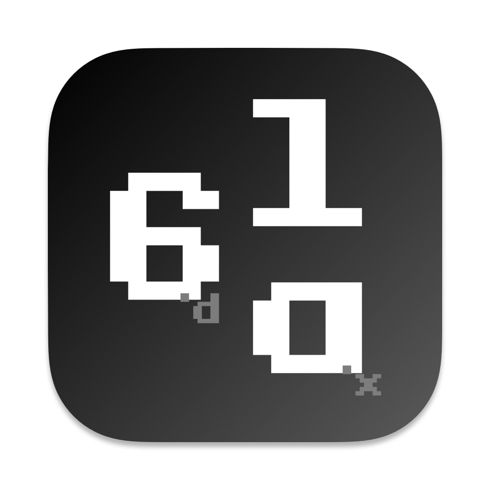
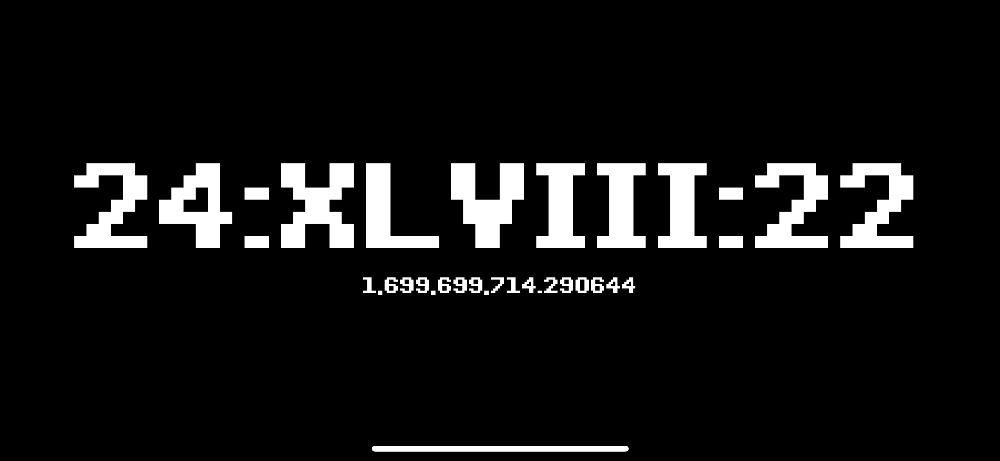

<h1 align="left">AnyClock 随意钟</h1>

 

<i>随意始，随意钟。</i>

## 介绍

Here's the thing. My high school friend gave me a cool electronic watch as a birthday gift. This electronic watch has
been in my room, but it will not be accurate after he walks for a long time. I'm too lazy to help him calibrate, so he
has become a very punk existence in the house - one that only shows The electronic clock in between. The meaning of his
existence is to display a string of time-like strings.

Nowadays, in reality, everyone has smart watches, smart bracelets, and smartphones, which can provide us with accurate
time. However, it is precisely because of these accurate times that sometimes makes us live in anxiety.

So, AnyClock appeared. He provides a seemingly less accurate time, a random decimal 10 second scale, which may increase
or decrease the time accuracy with the real moment at any time, and accompanied by a series of 13-bit timestamps at the
bottom.

AnyClock is like this, an electronic clock, which always reminds you that time is passing, but it does not tell you the
exact time and eliminates your anxiety about accurate time.

Sometimes, we should stop living in a hurry, give up the concept of accurate time, give ourselves some time to breathe,
spend more time with our families, and see this magical and beautiful world.

---

事情是这样的，之前高中朋友送了我一个炫酷的电子表当生日礼物，这个电子表一直放在我的屋子里面，但是他的走时时间久了之后会不准，我已经懒得帮他校准，于是他就成了屋子里面一个非常朋克的存在——一个仅仅显示时间的电子钟。他存在意义是显示一串时间一样的字符串。

如今现实中大家都有智能手表、智能手环、智能手机，这些设备都可以给我们提供准确的时间。但是，正是因为有这些准确的时间，有时候会让我们生活在焦虑之中。

于是，AnyClock就出现了。他提供了一个看起来不那么准确的时间，随机进制的十分秒刻度，可能随时会与现实时刻增加或减少的时间精度，以及伴随着底部一串13位时间戳。

AnyClock就是这样，一个电子时钟，他时刻提醒着你时间在流逝，但又不会告诉你准确的时间，杜绝你对准确时间的焦虑情绪。

有时候，我们是应该停下急促的生活脚步，放弃准确的时间概念，给自己一些喘息的时间，多陪陪自己的家人，多看看这个神奇而又美丽的世界。

## LICENSE

MIT
